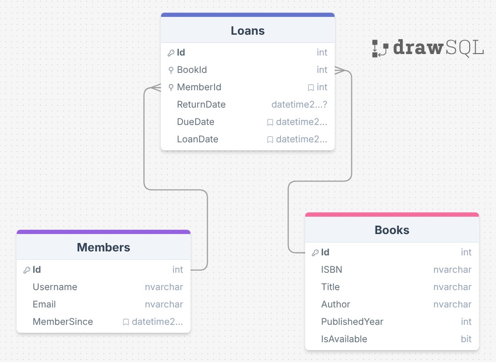

# 📚 LibrarySystem2

Ett bibliotekssystem byggt med **Blazor Server** och **ASP.NET Core**, med SQL Server som databas och Entity Framework Core som ORM. Systemet hanterar böcker, medlemmar och utlåning via ett modernt, reaktivt webbgränssnitt.

---

## Innehåll

- [Förutsättningar](#förutsättningar)
- [Kom igång](#kom-igång)
- [Projektstruktur](#projektstruktur)
- [Databasmodell](#databasmodell)
- [Gränssnittet](#gränssnittet)
- [Testprojekt](#testprojekt)

---

## Förutsättningar

| Verktyg | Version |
|---|---|
| .NET SDK | 9.0 |
| SQL Server | LocalDB / Express / fullversion |
| Visual Studio / Rider / VS Code | Valfri |

---

## Kom igång

### 1. Klona projektet

```bash
git clone <din-repo-url>
cd LibrarySystem2
```

### 2. Konfigurera anslutningssträngen

Öppna `appsettings.json` och uppdatera `DefaultConnection` om du inte använder LocalDB:

```json
"ConnectionStrings": {
  "DefaultConnection": "Server=(localdb)\\MSSQLLocalDB;Database=LibraryDB;Trusted_Connection=True;TrustServerCertificate=True;"
}
```

### 3. Kör migrationer och starta

```bash
# Applicera alla EF Core-migrationer (skapar databasen automatiskt)
dotnet ef database update

# Starta applikationen
dotnet run
```

Applikationen startar på `https://localhost:7202` (eller den port som visas i terminalen).

> **OBS:** Databasen seedas automatiskt med 16 exempelböcker vid första uppstart via `DbSeeder`. Inga användare seedas — dessa skapas vid första inloggning.

### 4. Logga in

Systemet använder **självregistrering** — det finns inget förinställt admin-konto:

| Scenario | Vad du fyller i |
|---|---|
| **Ny användare** | Ange valfritt användarnamn + e-postadress → ett nytt konto skapas automatiskt |
| **Återvändande användare** | Ange bara användarnamnet (e-post är frivillig) → loggas in direkt |

Inloggningsstatusen sparas i en cookie (`username`). Autentiseringsfiltret (`Authentication.filter.cs`) skyddar alla sidor utom `/Login` och Blazor-ramverkets interna sökvägar.

---

## Projektstruktur

```
LibrarySystem2/
├── Components/             # Blazor Server-komponenter
│   ├── Books/
│   │   ├── BookCard.razor       # Kortvy för en bok
│   │   ├── BookList.razor       # Lista med sökning, sortering & paginering
│   │   └── BookDetails.razor    # Detaljvy, utlåning & historik
│   ├── Loans/
│   │   └── LoanList.razor       # Lånehantering med filter
│   ├── Members/
│   │   ├── MemberList.razor     # Medlemslista
│   │   └── MemberDetails.razor  # Medlemsprofil & lånehistorik
│   └── GlobalSearch.razor       # Global sökning
├── Contexts/
│   └── Library.context.cs       # EF Core DbContext
├── Filters/
│   └── Authentication.filter.cs # Autentiseringsfilter (Razor Pages)
├── Infrastructure/
│   └── DbSeeder.cs              # Seed-data vid uppstart
├── Interfaces/                  # Repository-kontrakt
├── Migrations/                  # EF Core-migrationer
├── Models/                      # Domänmodeller
│   ├── Book.model.cs
│   ├── Member.model.cs
│   └── Loan.model.cs
├── Pages/                       # Razor Pages (login/logout/host)
├── Services/                    # Repository-implementationer
│   ├── BookRepository.cs
│   ├── MemberRepository.cs
│   └── LoanRepository.cs
└── Program.cs

LibrarySystem2.Tests/
├── BookRepositoryTests.cs       # 11 tester för BookRepository
├── LoanRepositoryTests.cs       # 13 tester för LoanRepository & domänlogik
└── MemberRepositoryTests.cs     # 17 tester för MemberRepository & Member-modell
```

---

## Databasmodell

Databasen består av tre tabeller kopplade via foreign keys.



### Tabeller

#### `Books`
| Kolumn | Typ | Beskrivning |
|---|---|---|
| `Id` | int (PK) | Primärnyckel, auto-increment |
| `ISBN` | nvarchar | Unikt ISBN-nummer |
| `Title` | nvarchar | Bokens titel |
| `Author` | nvarchar | Författarens namn |
| `PublishedYear` | int | Utgivningsår |
| `IsAvailable` | bit | `true` = tillgänglig, `false` = utlånad |

#### `Members`
| Kolumn | Typ | Beskrivning |
|---|---|---|
| `Id` | int (PK) | Primärnyckel, auto-increment |
| `Username` | nvarchar | Unikt användarnamn |
| `Email` | nvarchar | E-postadress |
| `MemberSince` | datetime2 | Registreringsdatum |

#### `Loans`
| Kolumn | Typ | Beskrivning |
|---|---|---|
| `Id` | int (PK) | Primärnyckel, auto-increment |
| `BookId` | int (FK) | Referens till `Books.Id` |
| `MemberId` | int (FK) | Referens till `Members.Id` |
| `LoanDate` | datetime2 | Datum för utlåning |
| `DueDate` | datetime2 | Förfallodatum för återlämning |
| `ReturnDate` | datetime2? | Faktiskt återlämningsdatum (`NULL` = ej återlämnad) |

### Relationer

```
Books ──────────────────── Loans ──────────────────── Members
  Id (PK)       1      *   BookId (FK)    *      1      Id (PK)
                            MemberId (FK)
```

- En **bok** kan ha många **lån** (historik) — `ON DELETE CASCADE`
- En **medlem** kan ha många **lån**
- Ett **lån** tillhör exakt en bok och en medlem

### Affärsregler i domänmodellen

- `Book.MarkAsBorrowed()` kastar `InvalidOperationException` om boken redan är utlånad
- `Book.MarkAsReturned()` sätter `IsAvailable = true`
- `Loan.IsOverdue` returnerar `true` om `DueDate` har passerats och boken inte är återlämnad
- `Loan.RegisterReturn()` sätter `ReturnDate` och anropar `Book.MarkAsReturned()`

---

## Gränssnittet

Applikationen använder **Blazor Server** för ett reaktivt SPA-liknande gränssnitt utan sidladdningar.

### Statistik (`/blazor`)
- Fyra statistikkort: totalt antal böcker, tillgängliga böcker, aktiva lån och försenade lån
- Tabell med de 5 senaste aktiva lånen inkl. förfallodatum och varning vid försening
- Tabell med de 5 senast registrerade medlemmarna inkl. antal aktiva lån
- Snabblänkar till böcker, medlemmar och lån

### Böcker (`/blazor/books`)
- Tabell med alla böcker, sorterbar på titel, författare och år
- Sökning i realtid på titel, författare eller ISBN
- Paginering (5 / 10 / 25 per sida)
- Lägg till, redigera och ta bort böcker via modaler
- Statusbadge: **Tillgänglig** (grön) / **Utlånad** (gul)

### Bokinformation (`/blazor/books/{id}`)
- Fullständig bokinformation
- Låna ut boken direkt — välj medlem och återlämningsdatum
- Varning vid försenat aktivt lån
- Knapp för att registrera återlämning
- Komplett lånehistorik i tabell

### Lån (`/blazor/loans`)
- Lista över alla lån med filter: **Alla / Aktiva / Försenade / Återlämnade**
- Räknare på försenade lån i filterknappen
- Skapa nytt lån direkt från sidan
- Ändra förfallodatum eller registrera återlämning

### Medlemmar (`/blazor/members`)
- Tabell med alla medlemmar, sorterbar
- Sökning på namn, e-post eller ID
- Lägg till, redigera och ta bort via modaler
- Antal aktiva lån visas direkt i listan

### Medlemsprofil (`/blazor/members/{id}`)
- Kontaktinformation och statistik (aktiva lån, försenade, totalt)
- Tabell med aktiva lån inkl. återlämningsknapp
- Komplett lånehistorik

---

## Testprojekt

Testprojektet (`LibrarySystem2.Tests`) använder **xUnit** och **EF Core InMemory**-databas för isolerade, snabba tester utan behov av SQL Server.

### Köra tester

```bash
cd LibrarySystem2.Tests
dotnet test
```

### Testöversikt

| Fil | Antal tester | Täcker |
|---|---|---|
| `BookRepositoryTests.cs` | 11 | CRUD, sökning, domänlogik (Book) |
| `LoanRepositoryTests.cs` | 13 | Lån, återlämning, försenade lån, domänlogik (Loan) |
| `MemberRepositoryTests.cs` | 17 | CRUD, sökning, domänlogik (Member), integration |
| **Totalt** | **41** | |

### Testmönster

Alla tester följer **Arrange / Act / Assert**-mönstret. Varje test använder en unik in-memory-databas för att garantera isolering:

```csharp
private LibraryContext CreateInMemoryContext( string dbName ) {
    var options = new DbContextOptionsBuilder<LibraryContext>()
        .UseInMemoryDatabase( databaseName: dbName )
        .Options;
    return new LibraryContext( options );
}
```